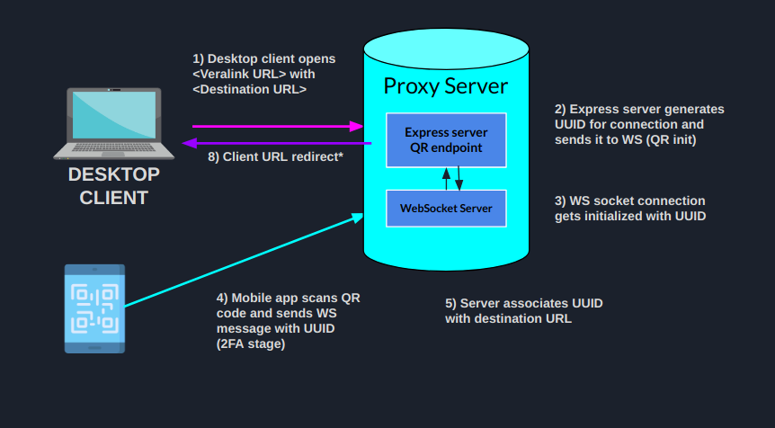

# Veralink Smartshield
Smartshield is a phishing protection mechanism that verifies remote URLs before redirecting the user to them. If a website is deemed to be fraudulent, the user is warned before proceeding.

# Problem it solves
Nowadays **SSL certificates** don't provide the layer of security we expect from them as end users. It is quite easy for an attacker to set up a website mimicking a legitimate organization using SSL encryption. Thus, this mechanism **cannot guarantee** the real identity of an organization.

# How does it work?

This repository defines a proxy server that sits between a scanner mobile application and the end URL to be verified.



# Pre-requisites
- Install [Node.js](https://nodejs.org/en/) @latest version
- Install [PM2 process manager](https://www.npmjs.com/package/pm2) 
# Getting started
- Clone the repository
```
git clone https://github.com/luisrowley/veralink-smartshield
```
- Install dependencies
```
cd veralink-smartshield
npm install
```
- Building and testing locally
```
pm2 start ecosystem.config.js --env development
```
- Navigate to `http://localhost:3000/`

# URL verify process
- Start [Smartshield SDK](https://github.com/luisrowley/veralink-smartshield-sdk) server (instructions on the repo)

- Navigate to the server providing the URL you want to verify as a GET parameter:
**`http://localhost:3000/?url=<URL-TO-VERIFY>`**

- For testing locally using the SDK server, the URL would be:
**`http://localhost:3000/?url=http://localhost:3001`**

- Finally, you would need to comile and run the [Mobile app verifier](https://github.com/luisrowley/veralink-smartshield-app) and scan the QR code you will see on screen.